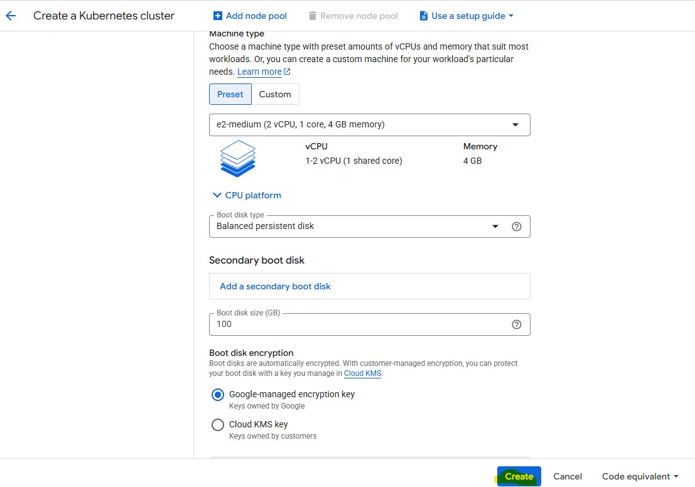
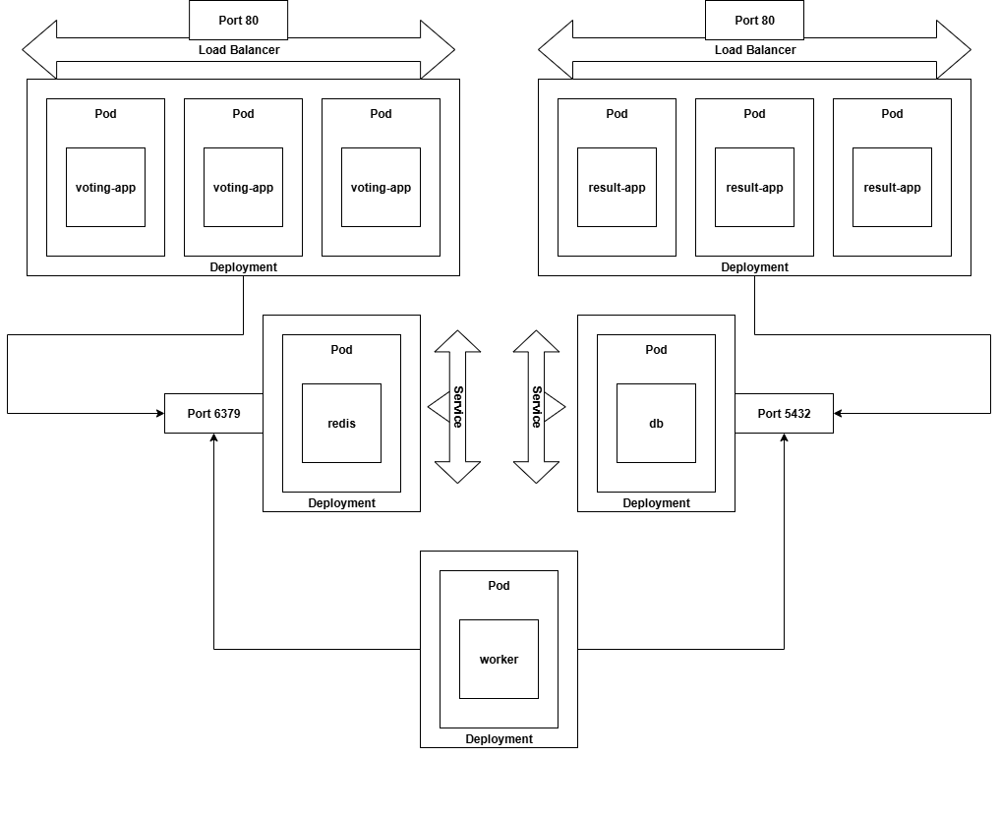

# Case Study Q1_Q2
1. The first task is to build a Kubernetes cluster. Setup a VM/VMs or Build a managed
Kubernetes cluster using AWS or GCP. You need to be able to explain and present the
deployment method and structure.
2. Build any type of application on top of your cluster (e.g. web service with DB, monitoring
system, etc..).

## Spin up Kubernetes Cluster on GCP

### Create Kubernetes Cluster at GCP Console

1. At GCP Console -> Left Blade -> Select Kubernetes Engine -> Clusters

2. Select __Create__. I selected __Standard__.

3. Fill `Cluster basics` section and once complete press *Next*
- Name: voting-app
- Location type: Zonal - *asia-south1-a*
- Target Release channel - Regular(*recommended*)
- Target version - 1.32.4-gke.1415000 (*default*)
- Cluster Tier: Standard tier  

4. Nodes Details
- Node Pool: default-pool
- Number of Nodes: 3
- Image type - Container-Optimized OS with containerd (cos_containerd)
- Node Machine Type - General Purpose e2 medium (2 vCPU, 1 Core, 4 GB Memory)

5. Leave untick for `Fleet Registration`.

6. Leaving untick for acces using DNS.

__Cluster networking__ , I use the default value.

7. Click __Create__ to create the cluster.

8. Wait for cluster creation and click on the `Refresh` button to check the status of the cluster.

9. Click into the Kubernetes cluster and select __Connect__ -> `Run in Cloud Shell`

10. The cloud shell will pop up. 

11. Run the command `gcloud container clusters get-credentials voting-app --zone asia-south1-a --project secure-wharf-465012-m0`. This is to configure the `kubectl` to access the Kubernetes Engine cluster from the Cloud Shell.

12. Run `kubectl get nodes` to verify the connection.

13. I will install the voting-app application via cloning the repository - https://github.com/kodekloudhub/example-voting-app/tree/master

14. Run `git clone <repo-url> -> Go into the folder k8s-specifications`. It contains the YAML file for deployment.

15. I will create it accroding to order as have dependency to each other.
- Run vote-deploment.yaml than vote-service.yaml
- Run redis-deployment.yaml than redis-service.yaml
- Run db-deployment.yaml than db-service.yaml
- Run worker-deployment.yaml
- Run result-deployment.yaml than result-service.yaml

16. Verify the deployment,services,pods are created and running properly

17. Go to Portal at `Kubernetes Engine -> Under Netwoking section -> Select Gateways,Services & Ingress -> Under tab -> Select Services`. Verify the Public IP addresses and click on it to go to the web page.

18. Open multiple page of Vote page (using Browser Incognito mode) to vote it. On parrallel monitor the result at result page.

- Vote app URL: http://34.47.220.219/ 
- Result app URL: http://35.200.244.1/

## Applications Architecture & Details

#### Vote App:
- This app is to display a page for the user to submit their votes. It runs a Python web server on port 80. It will send the voting results to Redis database.

#### Result App:
- This app will display the voting results. It fetches the updated count from the PostgreSQL database. It runs on Node.js server on port 80.

#### Worker App:
- This worker app will process the votes via reading from the Redis and than update the PostgreSQL databse. It runs on .NET server.

#### Redis Database:
- Act as in memory to store the votes and listening on port port 6379. Can be access by both Voting app and Worker app.

#### PostgreSQL(db) Database:
- Maintains aggregated vote counts with a service listening on port 5432. Can be access by both Worker app and Result app.

### Data Flow
1. Users will see a web the voting web page that is hosted on the Vote app.
2. Once user had selected their voting, the vote will send to Redis app database.
3. The Worker app will grab the vote data and than update the PostgreSQL database by incrementing the counts.
4. The user can see the vote result via the Result app page. The Result app pulls the data from PostgreSQL database for the result.

## Additional Notes

### Connect to GCP Kubernetes Cluster from Local Device

I had installed Ubuntu on my laptop WSL previously and wanted to test to configure it to connect to GCP Kubernetes cluster.

Below are the steps I carried out; 

1. gcloud SDK (Google Cloud CLI):

        sudo apt update

        sudo apt install apt-transport-https ca-certificates gnupg curl -y

        curl -sSL https://packages.cloud.google.com/apt/doc/apt-key.gpg | sudo gpg --dearmor -o /usr/share/keyrings/cloud.google.gpg

        echo "deb [signed-by=/usr/share/keyrings/cloud.google.gpg] http://packages.cloud.google.com/apt cloud-sdk main" | sudo tee /etc/apt/sources.list.d/google-cloud-sdk.list

        sudo apt update && sudo apt install google-cloud-sdk -y

2. kubectl CLI (Kubernetes CLI): 

        sudo apt install kubectl y

3. Install gke-gloud-auth-plugin

        sudo apt install google-cloud-sdk-gke-gcloud-auth-plugin -y

4. Login

        gcloud auth login --no-launch-browser

- Copy the URL and open on my Brower. Select my Google Account.

- Allow Google Cloud SDK to access.

- Click Allow

- Copy the verification code and put into my Ubuntu terminal. Once done, it manage to login using my Google Account.

5. At GCP Portal, go to my cluster and select `Connect`. Copy the command-line access and put into my Ubuntu terminal. 

6. Verify

        kubectl get deployments,services,pods -o wide

5. Logout

        gcloud auth revoke

