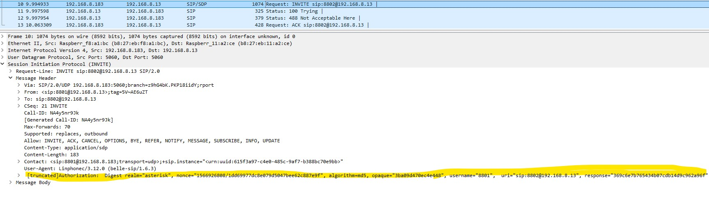

# Case Study Q3
Have a PCAP trace for any telecom use case on your laptop and be prepared for explaining it
on Wireshark (preferable related to IMS).

## Details
1. PCAP for SIP Call with Proxy Server in Between.
2. PCAP for SIP with 401 & 488 Error Code

### 1. PCAP for SIP Call with Proxy Server in Between

#### SIP Flow

10.33.6.101 - Calling Party  
10.33.6.100 - Called Party    
10.33.6.102 - Proxy

#### Call Flow Breakdown/Anaysis

1. INVITE (from 201@10.33.6.101 to 101@10.33.6.102)

- From the `From` & `To` header, we can see that this initial INVITE is send from `201@10.33.6.101 to 101@10.33.6.102`
- Contain SDP Offer for the media capabilites.
- Offer PCMA/G7.11 A-law, telephone-event/8000 (DTMF tones)

2. 100 Trying (from Proxy to calling party)
- Proxy send back 100 Trying to stop retransmission of INVITE.

3. INVITE (Proxy forwards to 101@10.33.6.102)
- The proxy add it's own Via header - `SIP/2.0/UDP 10.33.6.102:5080;branch=z9hG4bKac49822475`

4. 100 Trying (from called Party B to proxy)
Provisional response from the Called party. 

5. 180 Ringing (from called party to proxy)
- Indicates the called phone is ringing
- Contains `Contact: sip:101@10.33.6.100:5060`

6. 180 Ringing (proxy forwards to calling party)
- Proxy forwards the 180 response

7. 200 OK (from called party to proxy)
- Call is answered
- Contains SDP Answer with media capabilities that had been agreed.

8. 200 OK (proxy forwards to calling party)
- Proxy forwards the 200 OK response

9. ACK (from calling party to called party)
- Caller confirms receipt of 200 OK

10. BYE (from called party to calling party)
- Call termination initiated by callee
- `Reason: Q.850 ;cause=16 ;text="local".` Which `16` is a normal call clearing.

11. 200 OK (from calling party to called party)
- Caller confirms BYE receipt
- Call termination complete

### 2. PCAP for SIP 401 & 488 Error Code

#### Call Flow Breakdown/Anaysis

192.168.8.182 - A Softphone
192.168.8.183 - SIP Server

##### SIP Error 401 Code

1. Not and error condition but SIP challenge/response authencication mechanism/process.
2. The 1st SIP INVITE does not have the `Authorization Header`, comparing to the 2nd SIP INVITE.

1st SIP INVITE:

3. So the SIP Server (192.168.8.13) reply back with 401 Unauthorized
- The SIP server challeges back for authentication. 

4. On the 2nd SIP INVITE, the Authorization header was added and SIP Server no longer reply back 401 Unauthorized.

5. However after SIP Server 100 Trying, it reply back 488 Not Acceptable Here.

6. Since 488 Error code is about SDP/Media mismatch. Required to check on the 2nd SIP INVITE. 

7. Checking on the 2nd SIP INVITE, the SDP is showing `a=inactive` and `audio 0 RTP/AVP 0`.

8. This indicates the call has no active media streams, which the SIP Server may reject.

9. So for this scenario require to check on the `192.168.8.182 (Softphone)` side why it does not send valid media line or did doesit configure the correct Codecs to use. 

10.  I be categorize as `SDP Content Issues` or `Codec Mismatch`. 
